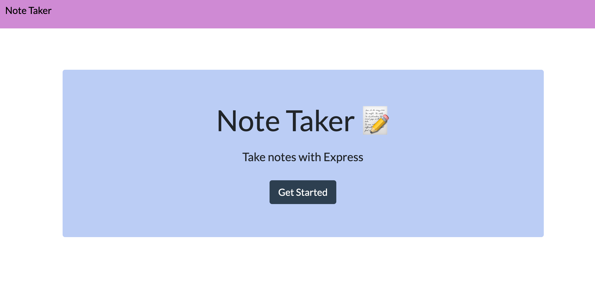

# express-note-taker

Using express to build a note taker page.The web app will begin to be hosted on localhost:2303. The note taker interface is displayed where the user can view previously saved notes, create new notes and delete notes.



## Site-video 
[Demo Video]()  

## Heroku-Deployed


# Table of Contents 
[Tittle](#express-note-taker)

[Guide Video](#Guide-Video)

[Heroku](#Heroku-Deployed)

[Table of Contents](#Table-of-Content)

[Description of Page Building](#Description-of-Page-Building)

[Code Snippet](#Code-Snippet)

[Technologies Used](#Technologies-Used)

[Author](#Author)

[License](#License)


## Description of Page Building 
* nmp install to download packages and dependencies 
  
* In server.js file  
  <ul> 
  <li> Create variables that require express, path, and other modules. 
  <li> Define routes using methods of the Express app object that correspond to HTTP methods
  <li> Write API post request to push users' sumits form to the apporiate 
  <li> Listen to PORT to start the server 
  </li>
  </ul>


* In html files 
  <ul> change Nav Bar color to make it more personal </ul>


## Code Snippet
Install npm package 
npm install express

Required variables 
``` Javascript
var express = require("express");
var path = require("path")
```

Sets up the Express app to handle data parsing
``` Javascript
app.use(express.urlencoded({ extended: true }));
app.use(express.json());
```

Set routes to handle when user "visit" the page 
``` Javascript
 app.get("/", (req, res) => {
  res.sendFile(path.join(__dirname, "/public/index.html"));
});
app.get("/api/notes", (req, res) => {
  fs.readFile(path.join(__dirname, "/db/db.json"), "utf8", (err, data) => {
    if (err) throw err;
    res.json(JSON.parse(data));
  });
});
app.post("/api/notes", (req, res) => {
  const db = JSON.parse(data);
  const newNoteList = [];
  db.push(req.body);
  for (let i = 0; i < db.length; i++) {
    const newNote = {
      title: db[i].title,
      text: db[i].text,
      id: i
    };
    newNoteList.push(newNote);
  }
  fs.writeFile(path.join(__dirname, "/db/db.json"), JSON.stringify(newNoteList, null, 2), (err) => {
    if (err) throw err;
    res.json(req.body);
  });
});
```

Listen to PORT to start the server 
``` Javascript 
app.listen(PORT, function () {
  console.log("App listening on PORT: " + PORT);
});
```

## Technologies Used
- Node - an open-source, cross-platform, back-end JavaScript runtime environment that executes JavaScript code outside a web browser.
  * [Node.js](https://nodejs.org/dist/latest-v14.x/docs/api/)
- Git - version control system to track changes to source code
  * [Git](https://git-scm.com/)
- GitHub - hosts repository that can be deployed to GitHub Pages
  * [Github](https://github.com/)
- Express - a Node js web application server framework, which is specifically designed for building single-page, multi-page, and hybrid web applications
  * [Express](http://expressjs.com/en/api.html#express)


## Author

* **B Tram Vu** 

- [Link to Portfolio Site](https://vubao2303.github.io/portfolio/)
- [Link to Github](https://github.com/vubao2303/express-note-taker)
- [Link to LinkedIn](https://www.linkedin.com/in/tram-vu-866250121/)

## License

© 2021 Trilogy Education Services, a 2U, Inc. brand. All Rights Reserved.